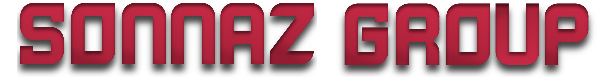

<p align="center">
  
</p>

<div style="text-align: center;">
<h1 align="center">📌 SG-WebDevelopment</h1>
<p align="center"><code>SG-WebDevelopment</code> is the source repository for the Sonnaz Group website and utility web pages, built with PHP page wrappers, reusable HTML includes, Bootstrap 5, and custom SCSS/JavaScript assets.</p>
</div>

---

<div style="text-align: center; padding-top: 30px">
<p align="center">


</p>
</div>

---

## Overview

This repository contains the website source for Sonnaz Group domains. The project uses PHP files as page entry points and composes each page from reusable HTML include files under `includes/`.

Styling is built from Bootstrap + custom SCSS in `scss/bootstrap.scss`, which compiles to `scss/bootstrap.min.css` used by pages. JavaScript behavior (navbar, scroll helpers, page interactions) lives in `js/`.

## Key pages

- `index.php` (Home)
- `aboutUs.php`
- `press.php`
- `releases.php`
- `FAQ.php`
- `status.php`
- `contact.php`
- `privacy.php`
- `terms.php`
- Utility pages: `dayTracker.php`, `discountCalculator.php`, `quickerTipper.php`, `roadmap.php`, `404.php`

## Repository structure

```text
SG-WebDevelopment/
├── .github/workflows/             # CI/CD workflows (production deploy pipeline)
├── Assets/                      # Images, icons, favicons, and other static assets
├── includes/                    # Reusable HTML partials for each page section
├── js/                          # Front-end scripts (Bootstrap bundle, navbar/custom logic)
├── scripts/                     # Release tooling (artifact packaging helpers)
├── scss/                        # Bootstrap entry SCSS + custom styles, compiled CSS outputs
├── dist/                        # Generated release artifacts (git-ignored)
├── *.php                        # Page entry points that compose includes/* content
├── index.html                   # Standalone static homepage variant
├── package.json                 # Node dependency metadata (Bootstrap currently tracked)
└── README.md
```

## How pages are composed

Most PHP pages follow this pattern:

1. Include the shared header partial (`includes/SonnazGroup_Header.html`)
2. Include page-specific content partial (`includes/SonnazGroup_*.html`)
3. Include shared footer partial (`includes/SonnazGroup_Footer.html`)
4. Load JavaScript bundles (`js/bootstrap.min.js`, Popper/CDN Bootstrap where present)

This keeps shared layout in one place while preserving simple route-like PHP entry files.

## Local setup (bootstrap)

### Requirements

- PHP-capable local server (Apache, NGINX + PHP-FPM, MAMP, etc.)
- Node.js + npm (for frontend package management and Sass tooling)

### Install dependencies

```bash
npm install
```

> The repository already tracks `bootstrap` in `package.json`.

### Add Sass compiler (if not installed yet)

```bash
npm install --save-dev sass
```

## SCSS -> CSS workflow

The main stylesheet entry is:

- `scss/bootstrap.scss` (imports Bootstrap core + custom SCSS)

Compiled output consumed by pages:

- `scss/bootstrap.min.css`
- `scss/bootstrap.min.css.map`

### One-time compile

```bash
npx sass scss/bootstrap.scss scss/bootstrap.min.css --style=compressed --source-map
```

### Watch mode (auto-recompile on save)

```bash
npx sass --watch scss/bootstrap.scss:scss/bootstrap.min.css --style=compressed --source-map
```

### Optional npm scripts to add

If you want this as `npm` commands, add these scripts in `package.json`:

```json
{
  "scripts": {
    "sass:build": "sass scss/bootstrap.scss scss/bootstrap.min.css --style=compressed --source-map",
    "sass:watch": "sass --watch scss/bootstrap.scss:scss/bootstrap.min.css --style=compressed --source-map"
  }
}
```

Then run:

```bash
npm run sass:build
npm run sass:watch
```

## Development notes

- Core theme colors and Bootstrap overrides are set in `scss/bootstrap.scss`.
- Project-specific styles live in `scss/custom.scss`.
- Keep compiled CSS in sync after SCSS changes before deploying.
- `npm test` is currently a placeholder script and does not run automated tests yet.

## Deployment context

Sonnaz Group is hosted on an internal server stack using NGINX and containerized services. This repository provides the website content and frontend assets deployed in that environment.

## Production release strategy (artifact-based)

This repository is the source-of-truth for website content. Production deploys are artifact-based:

1. Merge PRs into `main` (deploy is triggered on push to `main`)
2. GitHub Actions packages this repo as `dist/site-<sha>.tar.gz` plus checksum
3. Workflow uploads files to `${RELEASES_ROOT}/incoming` on server
4. Server deploy script verifies checksum and unpacks to `${RELEASES_ROOT}/releases/<sha>`
5. Server switches `${RELEASES_ROOT}/current` to that release
6. nginx repo `data` symlink points at `${RELEASES_ROOT}/current`
7. Docker compose is refreshed and health check is run

This removes the old nested repo sync problem and gives repeatable, versioned releases.

### Files used for this flow

- `.github/workflows/deploy-production-artifact.yml`  
  CI/CD pipeline that builds/uploads artifacts and triggers release activation.

- `scripts/create-release-artifact.sh`  
  Local/CI helper that packages the repo and generates checksum.

### Daily developer workflow

1. Create a feature branch (do not work directly on `main`)
2. Make code changes in `SG-WebDevelopment`
3. Preview locally at `http://localhost:8080` via nginx local stack
4. Open PR to `main`
5. Merge PR to deploy automatically

### Create an artifact locally (optional parity check)

```bash
bash scripts/create-release-artifact.sh
ls -lh dist/
```

Custom release id:

```bash
bash scripts/create-release-artifact.sh my-test-release
```

## GitHub Actions secrets required

Add these in `SG-WebDevelopment` -> **Settings** -> **Secrets and variables** -> **Actions**:

- `SSH_HOST`  
  Production server hostname or IP.

- `SSH_PORT`  
  SSH port (typically `22`).

- `SSH_USER`  
  Deploy user on server (must run deploy script and `docker compose`).

- `SSH_PRIVATE_KEY`  
  Private key for `SSH_USER` (deploy-only key recommended).

- `DEPLOY_SCRIPT_PATH`  
  Absolute server path to deploy script from nginx repo.  
  Example: `/path/to/Servers/nginx/scripts/deploy-artifact.sh`

- `RELEASES_ROOT`  
  Release root on server.  
  Recommended: `/srv/sonnaz`

- `HEALTHCHECK_URL`  
  URL checked after deploy.  
  Recommended for stability: `http://127.0.0.1`  
  (public domain checks can fail transiently during container restart/TLS reload).

- `KEEP_RELEASES`  
  How many past releases to keep.  
  Example: `5`

## Required one-time server setup

Follow the nginx repo README release strategy setup to:

1. Pull nginx changes on server
2. Create `/srv/sonnaz/releases` + `/srv/sonnaz/current`
3. Set `nginx/data -> /srv/sonnaz/current`
4. Ensure deploy user has docker compose permission
5. Ensure `DEPLOY_SCRIPT_PATH` is executable

## Troubleshooting

- Workflow cannot SSH:
  - Re-check `SSH_HOST`, `SSH_PORT`, `SSH_USER`
  - Verify key pair and server `authorized_keys`
  - Confirm firewall allows SSH

- Upload step fails with disk errors:
  - Check disk: `df -h`
  - Clean temporary/docker space as needed
  - Verify `${RELEASES_ROOT}/incoming` is writable

- Deploy script not found:
  - Verify `DEPLOY_SCRIPT_PATH` value
  - Run `chmod +x <deploy-script-path>`

- Health check fails after switch:
  - Check logs: `docker compose logs -f nginx php`
  - Temporarily set `HEALTHCHECK_URL` to `http://127.0.0.1`
  - Roll back to previous release (see nginx README)

- `error while creating mount source path .../nginx/data: ... file exists`:
  - `nginx/data` is a regular file, but Docker expects a directory/symlink source path
  - Fix on server:
    - `cd /root/nginx`
    - `mv data "data.bak.$(date +%s)"` (only if `data` is a file)
    - `mkdir -p /srv/sonnaz/releases /srv/sonnaz/current`
    - `ln -sfn /srv/sonnaz/current data`
    - `docker compose up -d nginx php certbot`
